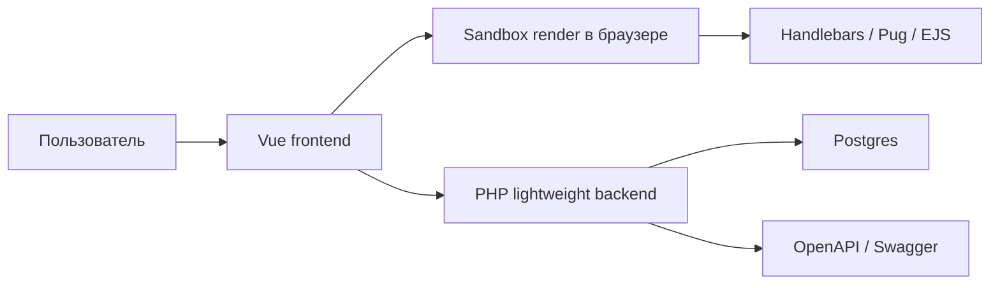

# Templating Render Lab: пользовательский гайд

Templating Render Lab - это стенд для сравнения шаблонизаторов и сохранения результатов benchmark-запусков. Приложение помогает быстро проверить, как один и тот же JSON-контекст рендерится разными template engines, сравнить вывод, замерить время выполнения и сохранить результаты для последующего анализа.

Подробный контракт backend API вынесен отдельно: [API_CONTRACT.md](./API_CONTRACT.md).

## Для чего нужно приложение

Основной сценарий - исследование и сравнение шаблонов на разных движках без отдельной настройки окружения для каждого шаблонизатора.

Приложение полезно, когда нужно:

- быстро набросать шаблон и JSON-контекст;
- сравнить два шаблона или два движка на одинаковом наборе данных;
- увидеть итоговый HTML/text output;
- прогнать benchmark на заданном количестве итераций;
- сохранить результат запуска и вернуться к нему позже;
- сохранить удачный шаблон в личную библиотеку;
- сделать шаблон публичным для других пользователей;
- поделиться ссылкой на состояние sandbox.

## Поддерживаемые шаблонизаторы

Сейчас frontend умеет рендерить шаблоны на клиенте через:

- `handlebars`;
- `pug`;
- `ejs`.

Каждый движок lazy-load-ится в браузере, а Monaco Editor получает подходящий syntax mode для текущего slot.

## Основные разделы интерфейса

### `/sandbox`

Главный рабочий экран. Здесь пользователь редактирует шаблоны, JSON-контекст, запускает benchmark и сохраняет результаты.

Страница состоит из трех зон:

- `header` - текущий активный slot, количество итераций, статус сохранения и режим preview/compare;
- `main` - редактор слева, preview/compare и метрики справа;
- `footer` - action bar с командами benchmark, save/share, save template и reset.

В sandbox есть два template slot:

- `Slot A`;
- `Slot B`.

Также есть отдельная вкладка `JSON`, где хранится общий контекст для обоих slot.

### `/templates`

Публичная библиотека шаблонов. Ее можно смотреть без авторизации.

На странице доступны:

- блок быстрого старта с preset-шаблонами;
- список публичных шаблонов;
- поиск по названию, описанию и движку;
- фильтр по движку;
- сортировка;
- открытие шаблона в текущем slot sandbox;
- клонирование шаблона в "Мои шаблоны" для авторизованного пользователя.

Важно: открытие шаблона из библиотеки загружает его только в активный slot sandbox, а не одновременно в A и B.

### `/dashboard`

Личный dashboard авторизованного пользователя.

Показывает:

- количество личных шаблонов;
- количество сохраненных benchmark-запусков;
- успешность запусков;
- среднее время успешных запусков;
- быстрые переходы в sandbox, мои шаблоны, мои запуски и публичную библиотеку;
- последние benchmark-запуски;
- краткий статус последней активности.

### `/dashboard/templates`

Управление личными шаблонами.

Возможности:

- просмотреть все свои шаблоны;
- отфильтровать по движку;
- найти по названию или описанию;
- открыть шаблон в sandbox;
- клонировать шаблон;
- удалить шаблон через деактивацию на backend;
- изменить публичность шаблона после сохранения.

Публичность можно переключать прямо из списка. Публичный шаблон становится доступен в `/templates`.

### `/dashboard/runs`

История сохраненных benchmark-запусков.

Показывает:

- общее количество запусков;
- процент успешных запусков;
- средний `avg`;
- лучший `avg` и `p95`;
- таблицу запусков с движком, статусом, количеством итераций, avg/min/max/p95, размером output и датой.

Есть фильтры:

- поиск по id, template id, движку или статусу;
- фильтр по движку;
- фильтр по статусу;
- фильтр по наличию метрик;
- сортировка по дате, avg, p95 и количеству итераций.

### `/s/:id`

Публичная ссылка на сохраненное состояние sandbox.

При открытии такой ссылки приложение загружает:

- `slotA`;
- `slotB`;
- общий JSON-контекст.

Авторизованный пользователь может сохранить себе копию состояния. Это создает новый state от имени текущего аккаунта.

### Auth pages

Доступны страницы:

- `/login`;
- `/register`;
- `/forgot-password`;
- `/change-password`.

Реальная авторизация работает через HttpOnly cookie. Frontend также проверяет текущую session через backend, чтобы UI не оставался в "залогиненном" состоянии после истечения cookie.

## Основные пользовательские сценарии

### Быстрый старт с preset

1. Откройте `/templates`.
2. В блоке "Быстрый старт" выберите preset.
3. Нажмите "Открыть в Sandbox".
4. Preset загрузится в активный slot sandbox.
5. При необходимости измените JSON-контекст.
6. Запустите preview или benchmark.

### Сравнение двух шаблонов

1. Откройте `/sandbox`.
2. Заполните `Slot A`.
3. Заполните `Slot B`.
4. Откройте вкладку `JSON` и задайте общий контекст.
5. Включите режим "Сравнить".
6. Проверьте вывод обоих slot.

### Benchmark

1. Откройте `/sandbox`.
2. Подготовьте `Slot A`, `Slot B` и JSON.
3. Выберите количество итераций: `100`, `500`, `1000`, `5000` или вручную `1..10000`.
4. Нажмите "Запустить бенчмарк".
5. Дождитесь завершения.
6. Посмотрите метрики:
   - `avgMs`;
   - `minMs`;
   - `maxMs`;
   - `p95Ms`;
   - `outputBytes`.

При любом изменении slot, JSON или количества итераций старые метрики сбрасываются, чтобы не сохранить stale-result для нового кода.

### Сохранение benchmark-запуска

1. Авторизуйтесь.
2. Запустите benchmark в `/sandbox`.
3. После появления метрик нажмите "Сохранить запуск".
4. Результат будет отправлен в backend как `benchmark-run`.
5. История доступна в `/dashboard/runs`.

Сейчас frontend сохраняет snapshot кода и контекста прямо в benchmark-run. Это не создает скрытый template на каждый запуск.

### Сохранение шаблона

1. Авторизуйтесь.
2. Откройте `/sandbox`.
3. Подготовьте нужный slot.
4. Нажмите "Сохранить как шаблон".
5. Выберите slot A или B.
6. Задайте имя и публичность.
7. Сохраненный шаблон появится в `/dashboard/templates`.

### Изменение публичности шаблона

1. Откройте `/dashboard/templates`.
2. Найдите шаблон.
3. Переключите `Публичный` / `Личный`.
4. Если шаблон публичный, он отображается в `/templates`.

### Share-ссылка на sandbox

1. Авторизуйтесь.
2. Откройте `/sandbox`.
3. Подготовьте оба slot и JSON.
4. Нажмите "Сохранить".
5. Приложение сохранит state на backend.
6. URL вида `/s/<stateId>` будет скопирован в clipboard.

Неавторизованные пользователи могут открыть публичную ссылку `/s/:id`, но для сохранения собственной копии нужно войти.

## Запуск локально через Docker

Минимальный запуск:

```bash
docker compose up --build
```

По умолчанию:

- frontend: `http://localhost:4173`;
- backend: `http://localhost:8000`;
- Swagger UI: `http://localhost:8000/docs`;
- OpenAPI JSON: `http://localhost:8000/openapi.json`;
- Postgres: `localhost:5432`.

Если локальный порт Postgres занят:

```bash
POSTGRES_HOST_PORT=55432 docker compose up --build
```

Миграции применяются автоматически при старте backend-контейнера через `backend/docker-entrypoint.sh`.

## Конфигурация окружения

Основные переменные:

- `VITE_API_URL` - backend URL для frontend build, по умолчанию `http://localhost:8000`;
- `FRONTEND_HOST_PORT` - порт frontend-контейнера, по умолчанию `4173`;
- `POSTGRES_HOST_PORT` - host-порт Postgres, по умолчанию `5432`;
- `JWT_SECRET` - секрет подписи auth-token;
- `PASSWORD_PEPPER` - pepper для паролей;
- `PASSWORD_WORK_FACTOR` - work factor password hashing;
- `COOKIE_SECURE` - `true` для HTTPS-стенда;
- `COOKIE_SAMESITE` - SameSite cookie mode, по умолчанию `lax`;
- `CORS_ORIGINS` - список разрешенных frontend origins.

Для тестового/prod стенда на HTTPS нужно выставлять `COOKIE_SECURE=true`.

## Архитектурная схема


